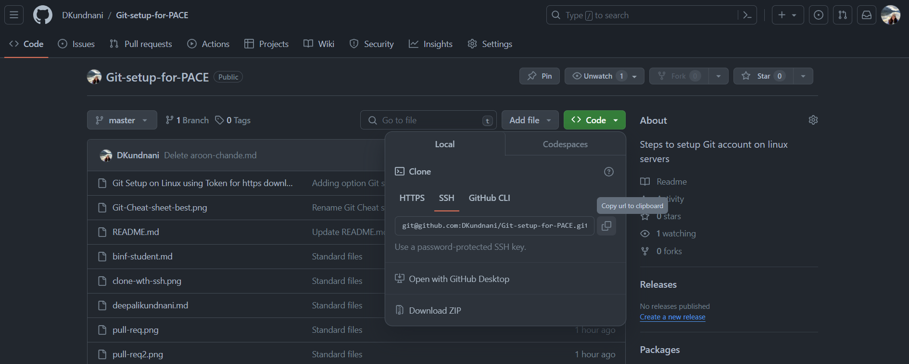
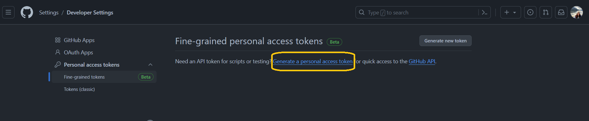

# Welcome to Git Setup on Linux Servers using SSH key and token for HTTPS sync. 

Git is a Source Code Management (scm) software, it is designed to help you keep
track of changes made to files.  SCM software is widely used in industry and
within government labs.  If you've ever used Dropbox, Google Drive, or similar,
than you've used a form of scm -- Dropbox keeps past versions of synced files
available so that you can restore them.  Git works be checking files into ("`git
add <file>; git commit <message>`", committing a file to history) a repository (repo for short).
Usually, you work on a local copy of the repo, and then merge your work into a
shared "master" copy of the files.  These additions and merges, or commits, form
a tree of changes.  For more complicated projects, this allows us to audit code
changes, track down people to yell at (`git blame`), and restore previous
version.  Git is a powerful tool, it does try to stop you from breaking
things... but, it doesn't try that hard.  So be careful and read warning and
error messages closely.

### Resources
1.  Read the [Getting Started Tutorial]( https://git-scm.com/book/en/v2/Getting-Started-Git-Basics), maybe use the [interactive tutorial](https://try.github.io/) 
2.  Log or Sign up into your Github account (https://www.github.com) 
3.  Click + Button to create a repository wiht README

## Git Setup on Linux Servers using SSH key

1.  SSH into the your server  
    *host*: login-phoenix-slurm.pace.gatech.edu  
    *port*: 22  
    *username*: Your gatech username, i.e. dkundnani3  
	*password*: Your gatech password  
	*Note*: You will need to connect to the GaTech VPN in order to log in
	```bash  
	ssh username@host #Enter and then enter your password and enter again. 
	```   
3.  Generate a public/private key   
	```bash  
	mkdir -p ~/.ssh   
	ssh-keygen -f ~/.ssh/github  
	<Follow the prompts, password is optional but suggested>  
	cat ~/.ssh/github.pub
	ssh-rsa 			AAAAB3NzaC1yc2EAAAABIwAAAQEAmooN/dvBVe29fqWCYw7LXFqjNzmVaBWGXf2H936JC3QgQ2XLYMFDQCQ/z62S0yVFTUjZGyDGFESfdeJI5BddKLOLEvrEsIQBOnpA4zaNAY6ET3Sc/XzaaG3up4wvsR7cibaJQLjTn3L3w+lN4SyVXp23kl80Rrzr6jsHAYeCscSI1WNSqxmqH3z6YmOMHSNqAMgT5A2zzVTVC6Yl7XV1w8wUjzogPklnLU/q3wJnJxCBV136+VaUft5rMYMuEsp62OK2CbpZYuAXmqdkiG0Q7x9irrjBcg2uqGBHCDvqN5T6o22Xp00A6aPmT+xE5RPpurWGu0RWaJN3BkCuq7QxlQ== dkundnani3@gatech.edu 
	```   
3.  Add this public key to your github account: https://github.gatech.edu/settings/keys   
4.  Add the below to `~/.ssh/config`   
	```
	host github.com
    	IdentityFile ~/.ssh/github
	```  

	Make sure to chmod 600 on `~/.ssh/config`  
5.  Clone the repo you created using SSH  
	    
6.  Write a brief intro to your repository in README using your favorite editor.  Be sure to use Markdown formatting! [Formatting guide](https://guides.github.com/features/mastering-markdown/)   
7.  Add your files and commit your changes. See [Cheatsheet](Git-Cheat-sheet-best.png)   
8.  If you make changes on the website, create a pull request. Refer the Cheatsheet [Cheatsheet](Git-Cheat-sheet-best.png)   


## Git Setup on Linux Servers using token for https download

1.  SSH into the your server  
    *host*: login-phoenix-slurm.pace.gatech.edu  
    *port*: 22  
    *username*: Your gatech username, i.e. dkundnani3  
	*password*: Your gatech password  
	*Note*: You will need to connect to the GaTech VPN in order to log in
	```bash  
	ssh username@host #Enter and then enter your password and enter again. 
	```   
2.  Generate a GitHub token
    - Assuming you have already created an account on [Github](www.github.com) and [verified your email address](https://docs.github.com/en/account-and-profile/setting-up-and-managing-your-personal-account-on-github/managing-email-preferences/verifying-your-email-address). If not please do so.
    - Under your profile, go to settings
          
    - Go to < > Developer Settings
    - Under Fine-grained tokens, click on generate personal access token
      
    - Set the actions allowable by the token, and generate the token
    - This token will be used as password while cloning or creating repositories on Linux server. 
3. Configure git
    - After step 1. If you don't already have git installed (i.e., which git returns nothing) then install it by following the instructions on this page. Note that students using WSL should install using the Ubuntu instructions.
    -  Configure your git installation so that you can interact with your github account repositories by running the following commands (substituting the placeholders with your data)
	```bash  
	git config --global user.email "<your email>"
	git config --global user.name "<your name>"
	git config --global credential.helper store
	```   
3.  Clone the repo you created using SSH  
	
	The Token created will be used a password while your cloning or creating Git repository. Please refer to the [Cheatsheet](Git-Cheat-sheet-best.png) 
5.  Write a brief intro to your repository in README using your favorite editor.  Be sure to use Markdown formatting! [Formatting guide](https://guides.github.com/features/mastering-markdown/)   
6.  Add your files and commit your changes. See [Cheatsheet](Git-Cheat-sheet-best.png)   
7.  If you make changes on the website, create a pull request. Refer the Cheatsheet [Cheatsheet](Git-Cheat-sheet-best.png)   


